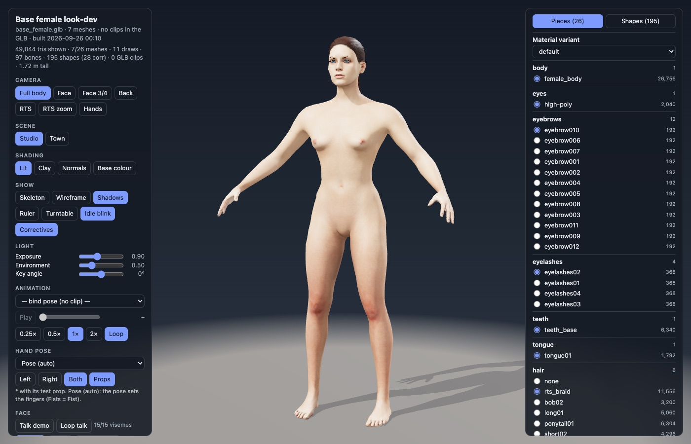

# RTS Characters

Work-in-progress rigged human characters for a fantasy RTS game: male and female base bodies on one shared 97-bone game
skeleton, with facial expressions, ARKit-style face shapes and visemes, customisation morphs, hair / brow / lash options,
poses, hand-grip presets and animation clips.

**View them in the browser:** https://lunarsong.github.io/character-models/

| Page | What you can do |
|---|---|
| [Female character](https://lunarsong.github.io/character-models/viewers/base_female.html) / [Male character](https://lunarsong.github.io/character-models/viewers/base_male.html) | Face and body sliders, randomise, hair / brows / lashes, expressions, poses, hand grips |
| [Female look-dev](https://lunarsong.github.io/character-models/viewers/base_female_lookdev.html) / [Male look-dev](https://lunarsong.github.io/character-models/viewers/base_male_lookdev.html) | Animation clips, every face shape and viseme, hand grips, lighting and shading modes |

Each page is self-contained (66-83 MB with the model inside), so the first load takes a moment.

## Work in progress

- Hair is an early version (card edges and scalp gaps up close; the female braid is rough); a rebuilt hair set is coming.
- Hand grips are new and still being tuned.
- The armoured knight and the other outfits (archer, peasant, mage) are being rebuilt and are not in this preview yet.

## What comes from MakeHuman, and what is ours

The bodies start from the free (CC0) MakeHuman base assets, loaded with the MPFB Blender add-on at build time. The body mesh
keeps MakeHuman's topology; its shape comes from MakeHuman's sliders at values we chose.

| Area | From MakeHuman (CC0) | Built by us |
|---|---|---|
| Body mesh | Base mesh and topology; shape from its sliders | The chosen settings, pose-driven corrective shapes, reworked skin weights, 18-region split for armour |
| Rig | Joint placement and skin weights of the default rig | 97-bone game skeleton (twist / helper bones, face rig), shared male/female rest pose, foot-contact solver, hand-grip library |
| Face | ARKit 52 face shapes + 15 visemes (packs by Mika Suominen) | Fixes (eye sockets, lids, wink, brows / lashes, lip seal), expression presets, talk demo |
| Customisation | Raw face and body targets | Two-way sliders carried onto every part, skeleton refit |
| Parts | Eyes, eyebrows, lashes, tongue, bob / long / ponytail / short hair | 28-tooth dentition and gums, cornea split, crop / braid grooms, beards, new hair system in progress |
| Skin | Base skin colour textures | Normal maps from a subdivided body, pores, roughness, AO, grading, skin tones |
| Clothing and armour | MPFB's fitting mechanism | All geometry, materials and heraldry; automated fit and intersection checks |
| Animation, export, viewers | None | All of it |

## Repository layout

- `index.html`, `images/`: the GitHub Pages landing page.
- `viewers/`: the four viewer pages (and `hand_poses.js`, which they load).
- `source/`: the pipeline that builds them (see [source/README.md](source/README.md)).

## Credits

Built with [Blender](https://www.blender.org), [MPFB](https://static.makehumancommunity.org/mpfb.html) and the CC0
[MakeHuman](http://www.makehumancommunity.org) assets. The viewers use [three.js](https://threejs.org) (loaded from jsDelivr).
